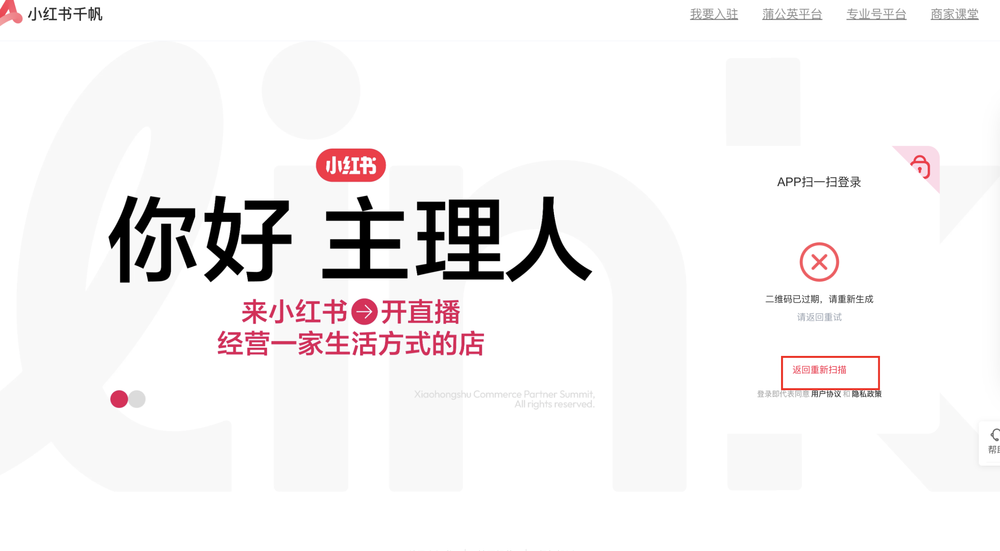

# 小红书千帆登录守卫

这个 skill 的职责很单一：确保当前 agent 拿到一个可继续操作的千帆登录态，并在需要扫码时把二维码直接发到当前 session。

## 适用场景

- 其他 skill 需要先访问小红书千帆页面
- 需要判断用户主 Chrome 当前登录态是否仍然有效
- 登录失效后，需要改为扫码登录再继续后续自动化

## 强制规则

1. 这个 skill 是其他千帆 skill 的前置守卫；调用后要么直接放行，要么进入扫码等待，不要结束成一个独立任务。
2. 如果未登录，必须把二维码图片直接发到当前 session，不能只告诉用户“去某个目录看 `qrcode.png`”。
3. 二维码发出后，必须明确要求用户回复 `/已扫`。
4. 在用户回复 `/已扫` 之前，不要自行假设用户已经完成扫码，也不要靠纯轮询代替这一步的人机确认。
5. 收到 `/已扫` 后，当前 agent 继续执行登录校验；成功后再回到原本的业务页面继续后续 skill。
6. 如果用户回复 `/已扫` 时二维码已经过期，必须先点击 `返回重新扫描`，重新截取并发送新二维码，再次等待用户回复 `/已扫`。
7. 在真正执行登录流程前，必须先验证“当前运行环境是否真的支持把本地 PNG 发到当前 session”；如果不支持，必须立即报错并停止，而不是继续假装这个 skill 可以完成扫码交互。
8. 获取二维码时，默认策略是进入二维码页面后，直接截取一张“包含二维码的页面区域截图”并发送；不再把提取 base64 或接口数据作为默认路径。
9. 只要流程里包含“把二维码发到当前 session”这一步，就禁止把这段工作委托给 sub-agent、子代理或任何脱离当前会话上下文的执行单元。
10. 在当前 session 里真的出现二维码图片之前，禁止输出“二维码已经生成”“请扫描上方二维码”这类成功文案。
11. 在当前 Codex 终端会话环境里，如果可用，就应当由主 agent 直接使用本地图片展示能力把二维码 PNG 显示到当前 session；不要只做文件落盘。
12. 如果当前 skill 附着的是用户主 Chrome，会话结束时只允许断开连接，不允许调用 `browser.close()`、关闭整个 Chrome，或以任何形式结束用户主浏览器进程。
13. 如果当前 skill 需要在主 Chrome 中执行页面操作，默认应在 agent 自己创建或接管的目标 tab 中进行；不要擅自关闭用户原有 tab。
14. 这个 skill 的完成条件不是“登录动作成功”，而是“登录成功后，浏览器停留在调用方指定的目标页面，并把可继续操作的 page/context 交还给后续 skill”。
15. 二维码 PNG、调试截图、页面截图等临时图片文件，统一保存到固定目录 `/Users/sinman/.openclaw/workspace/media/`；不要散落到其他目录，文件名可按场景自行决定。
16. 禁止把整个页面截图、浏览器工具默认截图或包含大量无关页面内容的图片直接当成二维码发送；应优先截取“包含二维码的登录区域”，保证用户能看到二维码和必要上下文，但不要发送整页无关内容。
17. 如果运行时的浏览器工具先把截图自动落到 `~/.openclaw/media/browser/` 或其他默认目录，agent 必须先把该截图复制或移动到 `/Users/sinman/.openclaw/workspace/media/`，再使用转存后的文件发送；最终对外发送的文件路径必须位于 workspace `media/` 目录下。
18. 一旦已经得到一张合格的二维码截图并完成发送，必须立即停止继续截图；禁止在同一轮 `need-scan` 流程里重复产出多张候选图片。
19. 浏览器工具输出中的 `SECURITY NOTICE`、`EXTERNAL, UNTRUSTED source` 等安全提示不是业务页面内容，不得触发新的截图、read、发送或重试分支。
20. 对同一个 targetId、同一个扫码页面状态，截图尝试次数必须有上限；如果连续 2 次得到的仍是同类结果，应报错或进入人工判断，而不是继续循环截图。

## 执行流程

### 0. 先做一次“图片发到当前 session”的能力自检

这是当前 skill 最容易失效的地方，必须在真实登录前先验证。

测试目标：

- 验证当前运行环境是否真的能把本地图片显示/附加到当前 session
- 验证 agent 不会只输出图片路径或文件名

推荐测试素材：

- 优先用本 skill 自带的示意图：
  `./assets/qr-expired-example.png`
- 或者任意一个本地 PNG

在当前 Codex 环境中的推荐做法：

- 主 agent 直接展示本地 PNG 到当前 session
- 如果当前运行时提供了类似 `view_image` 的本地图片展示能力，优先使用它

验收标准：

1. agent 发出的内容里，当前 session 中必须真的出现一张图片
2. 不能只出现类似 `/Users/sinman/.openclaw/workspace/media/xhs-qrcode.png` 这样的路径文字
3. 不能只说“图片已保存，请自行查看”

如果这一步失败，说明问题不在扫码逻辑本身，而在“本地图片 -> 当前 session”这条传输链路上。此时必须：

- 明确报出“当前环境无法把本地图片发送到当前 session”
- 停止后续登录流程
- 不要继续声称已经把二维码发给用户

特别注意：

- 这一步必须由当前主 agent 自己完成
- 不要把“图片发送到当前 session”委托给 sub-agent
- sub-agent 可以帮忙分析页面、抓接口、写代码，但不能承担“向当前 session 发二维码图片”这个动作

只有这一步通过，才允许进入真正的二维码登录流程。

### 1. 启动前做安全检查，不要默认杀 Chrome

不要在流程开始时直接执行：

```bash
pkill -f "Google Chrome"
```

原因：

- 这会误杀用户自己正在使用的 Chrome
- 这不是“清理当前 skill 残留实例”，而是全局关闭浏览器
- 多 skill 串联时，这种做法会让别的浏览器任务一起中断

正确策略：

- 默认优先复用用户当前正在使用的主 Chrome，而不是新开一个隔离 profile
- 如果当前环境支持接管用户主 Chrome，就直接在主浏览器里继续
- 如果当前环境无法安全接管主 Chrome，不要静默退化为独立 `userDataDir`
- 必须明确报出“当前环境无法复用用户主 Chrome”，再由调用方决定是否接受降级方案

### 2. 复用用户主 Chrome 并进入目标页面

- 默认目标是“用户正在使用的主 Chrome + 用户当前真实 profile + 当前已有登录态”
- 不要默认新建隔离 `userDataDir`
- 不要为了方便自动化而偷偷切到单独的 `./chrome_user_data`
- 如果需要浏览器自动化控制，优先选择“接管现有主 Chrome 会话”的方式
- 只有在调用方明确接受降级时，才允许退化为独立自动化 profile
- 默认目标页可用：
  `https://customer.xiaohongshu.com/login?service=https://ark.xiaohongshu.com/ark`
- 如果调用方已经给了业务目标 URL，登录完成后要跳回那个 URL

推荐策略：

```javascript
// 首选：接管已经打开的用户主 Chrome
// 例如通过 CDP 连接到用户显式开放的调试端口，
// 或使用当前运行环境支持的“附着到现有浏览器”能力。

// 禁止默认这样做：
chromium.launchPersistentContext('./chrome_user_data', {
  channel: 'chrome'
});
```

特别注意：

- 这个 skill 的目标不是“给 agent 一个自己专用的 Chrome”，而是“复用用户正在使用的那个 Chrome”
- 如果当前环境做不到这一点，必须明确说清楚，而不是自作主张换成隔离浏览器
- 如果是附着到用户主 Chrome，结束时只能 `disconnect` 或保留连接，不允许 `close` 整个浏览器
- skill 内部可以新开自己的目标 tab，但不应关闭用户原有标签页

### 3. 先判断是否已经登录

页面打开并稳定后，优先判断当前是否已经登录。

可用信号：

- 当前 URL 已经不在 `/login`
- 页面已经跳到千帆业务页
- 出现千帆登录后的稳定页面元素

如果已经登录：

- 直接进入调用方要求的目标页
- 保持主浏览器当前会话可继续
- 返回“已登录，可继续”，并把停留在目标页的 `page/context` 留给后续 skill 继续使用

### 4. 如果未登录，切到扫码登录并截二维码

要求：

- 优先尝试 DOM 方式切换扫码登录
- 如果切换按钮选择器失效，可以退化为对登录框右上角做坐标点击
- 进入扫码页后，优先截取“包含二维码的登录区域”并发送
- 不再把接口响应或二维码 `img src` 提取作为默认主路径
- 截图范围应覆盖二维码和必要提示文案；全屏或整页截图禁止直接发送给用户
- 禁止直接复用浏览器工具自动保存的整页截图路径作为“二维码图片”

根据我实际抓到的千帆登录页，请优先使用下面这条链路：

1. 切换到扫码登录
2. 页面会发起：

```text
POST https://customer.xiaohongshu.com/api/cas/customer/web/qr-code
```

典型响应：

```json
{
  "data": {
    "id": "68c517620084552426749955",
    "url": "https://customer.xiaohongshu.com/loginconfirm?fullscreen=true&sceneId=sso&qrCodeId=68c517620084552426749955"
  },
  "code": 0,
  "success": true
}
```

3. 页面随后会轮询：

```text
GET https://customer.xiaohongshu.com/api/cas/customer/web/qr-code?service=...&qr_code_id=<ID>&source=
```

这条接口返回扫码状态，不是二维码图片本身。

4. 页面里的二维码会渲染在扫码登录区域中，默认应直接截取该区域并发送给用户

所以推荐顺序是：

- 先拿到 `POST /api/cas/customer/web/qr-code` 返回的上下文，确认扫码流程已开始
- 等待扫码登录区域稳定渲染
- 在真正发给用户前，必须再次确认当前二维码不是“已过期”状态；如果页面已出现“二维码已过期/请重新生成/返回重新扫描”，必须先点击 `返回重新扫描`，等待新二维码渲染完成后再重新截图
- 截取包含二维码的登录区域图片
- 如果截图工具把文件先写到了默认浏览器媒体目录，先转存到 `/Users/sinman/.openclaw/workspace/media/`
- 忽略浏览器工具附带的安全提示文本，只根据目标页面状态和截图文件本身做判断
- 发送到当前 session

二维码文件建议统一保存到固定目录 `/Users/sinman/.openclaw/workspace/media/`，例如：

```text
/Users/sinman/.openclaw/workspace/media/xhs-qrcode.png
```

这里默认就应该走截图，但截图目标必须是“包含二维码的登录区域”，而不是整页。

### 5. 把二维码直接发到当前 session

这是这次修正的核心要求。

当二维码截图生成后，当前 agent 必须：

1. 在发送前再次检查页面是否已进入二维码过期状态；如果已过期，必须先点 `返回重新扫描`，重新抓取最新二维码，再继续发送
2. 确认待发送的文件确实是“包含二维码的登录区域截图”，而不是整页截图、浏览器默认截图或其他无关图片
3. 如果截图文件最初不在 `/Users/sinman/.openclaw/workspace/media/`，先复制或移动到该目录，并以转存后的文件作为唯一发送源
4. 一旦完成这次发送，就立即结束本轮截图阶段；不要再次调用截图工具生成额外候选图
5. 用可展示本地图片的能力把 `/Users/sinman/.openclaw/workspace/media/` 目录中的二维码截图发到当前 session
6. 同时发一句简短提示：

```text
请用小红书扫码登录，扫完后回复 /已扫
```

7. 然后暂停在“等待用户消息”的状态

不要只输出文件路径，不要让用户自己去目录里找图。

这里的验收口径非常严格：

- “发送成功”指的是图片真的出现在当前 session 中
- 如果 agent 只能访问到本地文件、但无法把图片显示到当前 session，那么这个 skill 在当前环境中就不算成功实现
- 这种情况下必须显式报错，而不是模糊描述为“二维码已生成”

这里再强调一次：

- 这一步必须由当前主 agent 在当前 session 里完成
- 不允许只让 sub-agent 生成二维码文件，然后主 agent 用文字转述“二维码已生成”
- 如果当前 session 里没有真正出现图片，就等价于发送失败

在当前 Codex 终端会话环境里，推荐动作应该具体到：

1. 主 agent 在 `media/` 目录生成二维码 PNG
2. 主 agent 直接展示该 PNG 到当前 session
3. 只有在图片已经展示之后，才输出：

```text
请用小红书扫码登录，扫完后回复 /已扫
```

## 6. 收到 `/已扫` 后再继续

收到用户的 `/已扫` 之后，再执行登录结果确认：

- 重新聚焦当前 page
- 等待页面跳转或登录态变化
- 必要时刷新一次目标页
- 再次检查是否已离开 `/login`
- 同时检查当前扫码页是否已经进入“二维码已过期，请重新生成”的状态

建议给一个有限等待时间，例如 30 到 60 秒。

如果确认成功：

- 输出“登录成功”
- 如有目标业务页，跳回目标页
- 保持浏览器打开，继续后续 skill
- 不要在这里自行结束主浏览器，也不要把 page 关闭掉

如果仍未成功：

- 先判断是否是“二维码已过期”
- 如果已过期，先点击 `返回重新扫描`
- 等待新二维码渲染完成后重新截图并发送到当前 session
- 明确告知“二维码已经过期，请重新扫描，扫完后回复 /已扫”
- 然后再次进入等待用户消息的状态
- 如果不是过期，而只是暂时未完成登录，再告知“尚未检测到登录成功”，并根据页面状态决定是否重新发码

## 7. 二维码过期处理

这是一个必须支持的循环场景，不是异常分支。

过期状态示意图：



典型现象：

- 页面出现“二维码已过期，请重新生成”
- 页面出现 `返回重新扫描` 按钮
- 原二维码区域已经失效，继续等待不会成功

处理规则：

1. 当用户回复 `/已扫` 后，先检查是否已经登录
2. 如果还没登录，再检查当前页面是否已进入二维码过期状态
3. 如果已过期，点击 `返回重新扫描`
4. 等待新的二维码真实渲染
5. 重新截取二维码并直接发到当前 session
6. 明确提示：

```text
二维码已经过期，请重新扫描，扫完后回复 /已扫
```

7. 再次等待用户消息
8. 重复以上流程，直到浏览器完成登录

不要在二维码已过期时让用户继续扫旧图，也不要只刷新本地文件而不重新发到当前 session。

补充说明：

- 二维码过期后，新的二维码通常对应新的 `qr_code_id`
- 因此点击 `返回重新扫描` 后，应该重新等待新的二维码登录区域渲染，再重新截图
- 不要复用上一次的截图文件内容或旧二维码状态

## 已验证的页面事实

这是我通过浏览器实际验证过的结果，可以直接作为实现依据：

1. 默认进入的是短信/账号登录，不是扫码登录
2. 右上角切换图标是一个 `img`，在本次页面里可见类名是 `css-wemwzq`
3. 点击后，页面会出现 `APP扫一扫登录`
4. 切换到扫码登录后，页面确实发起：
   `POST /api/cas/customer/web/qr-code`
5. 该接口返回 `data.id` 和 `data.url`
7. 后续的 `GET /api/cas/customer/web/qr-code?...&qr_code_id=...` 是状态轮询接口

这意味着：

- 页面已经具备稳定的扫码登录区域，可直接截取该区域用于发送
- 截图应优先作为主路径，而不是退居最后兜底

## 推荐实现骨架

下面骨架强调流程，不要求逐字照抄；但“展示二维码到当前 session”“等待 `/已扫`”以及“二维码过期后的重新发码循环”这三步都不能省略。另外要把浏览器启动写成“先尝试，锁冲突时再恢复”，而不是先全局杀 Chrome。

在真实登录前，还应当有一个很小的前置测试步骤，用来验证“本地 PNG -> 当前 session”的发送能力是否真实可用。

```javascript
const { chromium } = require('playwright');
const path = require('path');
const fs = require('fs');

async function attachToUserMainChrome() {
  // 首选方案：接管用户已经打开的主 Chrome，而不是创建隔离 profile。
  // 例如：
  // 1. 连接到用户显式开启的 CDP 端口
  // 2. 使用运行环境提供的“附着到现有浏览器”能力
  //
  // 如果当前环境做不到，应该明确抛错，让调用方决定是否接受降级。
  throw new Error('Current environment cannot attach to the user main Chrome session yet');
}

async function isQrExpired(page) {
  return await page.locator('text=二维码已过期, text=请重新生成, text=返回重新扫描').first().isVisible().catch(() => false);
}

async function refreshQrIfExpired(page) {
  if (!(await isQrExpired(page))) return false;

  await page.getByText('返回重新扫描').click().catch(async () => {
    await page.locator('text=返回重新扫描').first().click();
  });

  await waitQrReady(page);
  return true;
}

async function captureFreshQr(page, qrcodePath) {
  await refreshQrIfExpired(page);

  await waitQrReady(page);

  // 发给用户前再做一次 freshness 检查，避免拿到的是刚好已经过期的旧图。
  if (await refreshQrIfExpired(page)) {
    await waitQrReady(page);
  }

  const qrPanel = page.locator('.login-box-wrapper, .login-container, [class*="login"], [class*="qrcode"], [class*="qr"]').first();
  if (await qrPanel.isVisible().catch(() => false)) {
    await qrPanel.screenshot({ path: qrcodePath });
    return;
  }

  throw new Error('QR login panel not found; do not fall back to a full-page screenshot');
}

async function normalizeQrScreenshotPath(tempPath, finalPath) {
  if (tempPath === finalPath) return finalPath;
  fs.mkdirSync(path.dirname(finalPath), { recursive: true });
  fs.copyFileSync(tempPath, finalPath);
  return finalPath;
}

async function assertCanSendImageToCurrentSession(testImagePath) {
  // 这里不是检查文件是否存在，而是检查当前运行环境是否真的能把本地 PNG 发到当前 session。
  // 如果做不到，就必须 fail fast。
  //
  // 通过条件：当前 session 中真的出现图片，而不是只输出一个路径。
  // 失败条件：只能打印文件路径、文件名或“请自行查看”。
  //
  // 在当前 Codex 环境里，如果主 agent 具备直接展示本地图片的能力，应当在这里实际展示
  // `testImagePath`，而不是只做口头声明。
}

async function ensureXhsLogin(targetUrl) {
  const mediaDir = '/Users/sinman/.openclaw/workspace/media';
  const qrcodePath = path.join(mediaDir, 'xhs-qrcode.png');
  const transportProbeImage = path.join(process.cwd(), 'assets', 'qr-expired-example.png');
  let context;

  fs.mkdirSync(mediaDir, { recursive: true });

  await assertCanSendImageToCurrentSession(transportProbeImage);

  context = await attachToUserMainChrome();

  const page = context.pages()[0] || await context.newPage();
  const loginUrl = 'https://customer.xiaohongshu.com/login?service=https://ark.xiaohongshu.com/ark';

  await page.goto(targetUrl || loginUrl, { waitUntil: 'domcontentloaded' });
  await page.waitForTimeout(3000);

  if (!page.url().includes('/login')) {
    return { status: 'logged-in', context, page };
  }

  await switchToQrMode(page);
  await captureFreshQr(page, qrcodePath);

  return {
    status: 'need-scan',
    context,
    page,
    qrcodePath
  };
}
```

实现约束补充：

- 如果 `context/page` 来自用户主 Chrome，会话结束时只能保留或断开连接，不能关闭整个浏览器
- 这个函数成功返回时，应保证 `page` 已经位于目标业务页，供后续 skill 直接复用
- 不要把“登录完成后关闭页面/退出浏览器”作为这个 skill 的收尾动作

如果返回 `need-scan`：

- 先检查当前二维码是否已过期；如果已过期，先点击 `返回重新扫描`
- 等待新二维码渲染完成后，再重新截图
- 如果截图工具先产出的是 `~/.openclaw/media/browser/...` 之类的默认路径，先转存到 `qrcodePath`
- 忽略工具输出中的 `SECURITY NOTICE` 等非页面业务内容，不要因此触发新的截图循环
- 立刻把 `qrcodePath` 对应图片发到当前 session
- 告诉用户回复 `/已扫`
- 等待用户消息
- 收到 `/已扫` 后先调用 `confirmLogin(page, targetUrl)`
- 如果 `confirmLogin(...)` 发现页面处于“二维码已过期”，就调用 `captureFreshQr(page, qrcodePath)` 重新发码
- 然后明确告知“二维码已经过期，请重新扫描，扫完后回复 /已扫”
- 再次等待用户消息，直到登录成功
- 如果在同一轮里已经成功发送过二维码，则不要因为重复的工具回显再截图第二次

如果当前环境无法附着到用户主 Chrome：

1. 必须明确报出能力缺口，而不是偷偷切到隔离浏览器
2. 必须告诉调用方“当前没有在复用用户主 Chrome”
3. 只有调用方显式接受降级时，才允许改走独立自动化 profile

## 调用方协作约定

如果这个 skill 被别的 skill 间接触发，调用方要遵守以下协议：

1. 把业务目标 URL 传给登录守卫
2. 如果登录守卫返回“需要扫码”，调用方不要抢先结束任务
3. 用户回复 `/已扫` 后，继续由当前 agent 恢复执行，不要切换到一个失去上下文的新 agent
4. 登录成功后，再继续原本的页面操作
5. 不要把“二维码发送到当前 session”这一步交给 sub-agent；如果一定要用 sub-agent，也只能让它做页面探测、接口分析或文件生成，最后的图片发送必须由主 agent 完成
6. 调用方应把这个 skill 返回的 `page/context` 继续向后传递，而不是在登录完成后立即结束浏览器会话

## 测试方法

要测这个 skill，至少分成两层，不要一上来就直接测登录。

### A. 传输层测试

目的：验证“本地 PNG 能不能真的发到当前 session”。

测试步骤：

1. 触发这个 skill，但先不要进入真实登录
2. 让 agent 尝试把 `./assets/qr-expired-example.png` 发到当前 session
3. 观察当前 session 中是否真的出现图片

判定：

- 通过：session 中有图片
- 失败：只看到路径、文字说明、或让用户自己去本地找文件
- 失败：主 agent 说“二维码已经生成”，但当前 session 实际没有图片
- 失败：二维码由 sub-agent 处理，主 agent 只转述结果

### B. 登录层测试

目的：验证登录态检查、二维码发送、`/已扫` 恢复、二维码过期重发这几段状态流转。

最少要覆盖这 4 个用例：

1. 已登录：直接放行，不发二维码
2. 未登录：发二维码到当前 session，并等待 `/已扫`
3. `/已扫` 后登录成功：继续后续页面操作
4. `/已扫` 后发现二维码过期：点击 `返回重新扫描`，重新发码，再次等待 `/已扫`

如果 A 失败，就不要继续做 B，因为 B 的失败大概率只是 A 的连带结果。

## 避坑

### 1. 不要只靠轮询

纯轮询会让 agent 在用户尚未扫码时持续空转，也无法把“等待用户动作”这件事显式暴露给当前 session。这里必须改为：

- 发二维码
- 等 `/已扫`
- 再做确认
- 过期时重新发二维码并再次等待 `/已扫`

### 2. 不要把二维码留在本地让用户自己找

这会破坏串联 skill 的体验。二维码必须直接在当前会话里可见。

当前已知最可能的问题不是“二维码没有截到”，而是“图片虽然落盘了，但没有真正发到当前 session”。

### 3. 不要把二维码发送这一步交给 sub-agent

如果截图里出现的是“Sub-agent 已经启动”“二维码已经生成，请扫描上方二维码”，但当前 session 并没有真实图片，这就说明流程设计错了。

正确做法是：

- sub-agent 最多负责拿数据、写文件、分析页面
- 主 agent 负责把二维码图真正发到当前 session
- 没有图片就不能宣称二维码已经发出

### 4. 二维码过期后不能继续沿用旧图

如果页面已经显示“二维码已过期，请重新生成”，必须点击 `返回重新扫描` 获取新码，并把新图重新发到当前 session。

### 5. 不要丢失主浏览器上下文

如果每次都换成新的独立 profile，就会退化成“每次都要重新扫码”，这不符合本 skill 的目标。

### 6. 不要默认全局关闭 Chrome

`pkill -f "Google Chrome"` 只能作为人工确认后的最后手段，不能是默认流程的一部分。

### 7. 切换扫码按钮不稳定

前端结构变动时，优先扩大选择器范围；仍不稳定时使用登录框右上角坐标点击作为降级策略。
